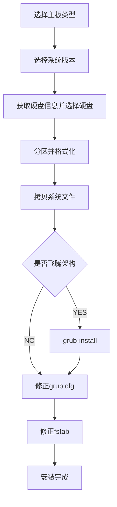

# make_os_disk
在linux虚拟机上将其他平台操作系统烧录到指定硬盘的工具。

# 当前分支为 bash tui 版本, tui 功能由 whiptail 实现

# 工作流程

```mermaid
graph TD
    A[选择主板类型] --> B[选择系统版本]
    B --> C[获取硬盘信息并选择硬盘] --> D[分区并格式化]
    D --> E[拷贝系统文件]
    E --> F{是否飞腾架构} 
    F --YES--> G[grub-install]
    F --NO--> H[修正grub.cfg]
    G --> H --> I[修正fstab] --> J[安装完成]
    
```

# TODO:
- 错误处理
- whiptail美化
- 拆分主程序