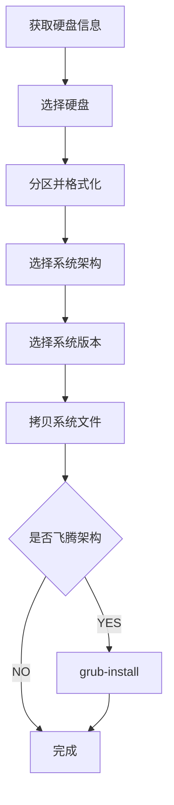

# make_os_disk
在linux虚拟机上将其他平台操作系统烧录到指定硬盘的工具。

# 工作流程

```mermaid
graph TD
    A[获取硬盘信息] --> B[选择硬盘] --> C[分区并格式化]
    C --> D[选择系统架构] --> E[选择系统版本] --> F[拷贝系统文件]
    F --> G{是否飞腾架构} 
    G --NO--> H[完成]
    G --YES--> I[grub-install] --> H
```

# 计划实现的版本
- bash tui (whiptail)
- bash gui (yad)
- python gui (pyqt)